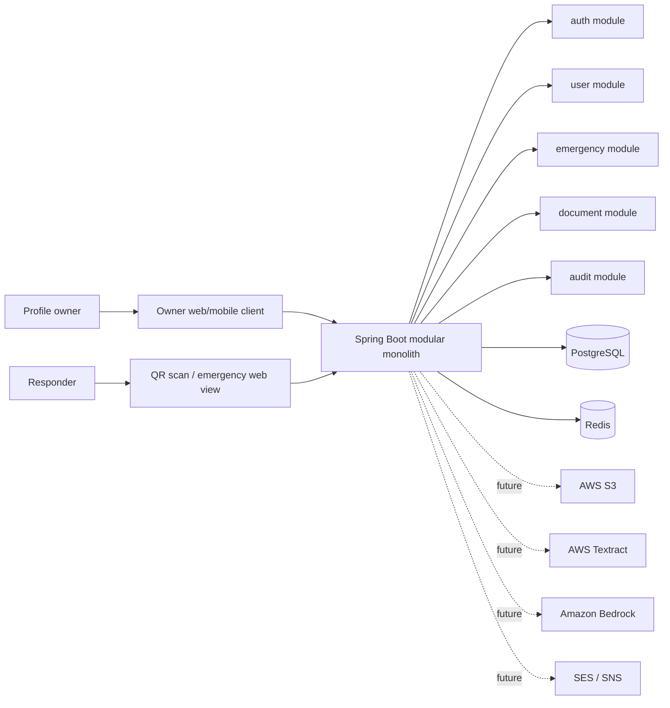

# SOS-ID architecture — Phase 1

## Scope and boundaries

SOS-ID lets a profile owner maintain an emergency profile and present a QR code. A scan may create a strictly time-bounded emergency session through which a responder can see only the data the owner has authorized for emergency disclosure. Phase 1 includes user identity, profile management, QR credential lifecycle, emergency session delivery, and auditability.

> **New decision — document authorization.** Medical documents have independent per-document access policies. QR possession remains a constrained emergency capability, not responder authentication. A QR session may directly retrieve a `PUBLIC_TO_QR` document. It may discover, request, and—only after registered-contact OTP verification—temporarily retrieve a `PRIVATE` document. Document access authorization never survives the emergency session that scoped it.

The platform must not treat a QR code as authentication of a responder. It is an emergency access credential with intentionally constrained data and a short expiry. Requirements for responder identity, institution verification, consent workflows beyond the profile's emergency disclosure policy, and clinical decision support are not assumed.

Document storage, ingestion/OCR, AI features, notifications, and general file processing remain out of scope for Phase 1 implementation. This revision specifies their authorization/data model boundary so that a later implementation can be added without weakening the core QR-session model. Delegated/family management remains out of scope.

## Architecture

A modular monolith is the initial deployment unit: one Spring Boot application, one relational database, and separate managed infrastructure services. Modules own their use cases and persistence mappings; other modules interact through application-level interfaces/events, not direct table access.

## Module responsibilities

| Module | Owns in Phase 1 | Must not own |
|---|---|---|
| `auth` | account authentication, session/token issuance, password reset or federated identity integration | emergency disclosure decisions |
| `user` | user account representation and emergency profile editing | QR session state |
| `emergency` | QR credentials, short-lived emergency sessions and responder profile projection | account authentication or document-policy ownership |
| `medical` | emergency-data schema and validation | clinical interpretation |
| `document` | document metadata, per-document policy, access requests, OTP challenges, temporary authorization, controlled download decision | storing binaries in PostgreSQL or general profile authorization |
| `audit` | immutable security and access-event recording | authorization decisions |
| `config`, `common` | configuration, error model, IDs, time, validation, cross-cutting primitives | domain ownership |
| `document`, `session`, `notification`, `ai`, `storage` | reserved future boundaries | Phase 1 processing |

## Key design decisions

- PostgreSQL is the source of truth for users, profiles, QR credentials, and the durable audit trail.
- Redis is disposable and used only for expiry-aware session lookup, rate limits, and revocation propagation. A Redis loss must fail closed for emergency access until the session can be validated against PostgreSQL.
- A QR payload contains an opaque, high-entropy credential reference—not a user ID, profile ID, medical data, signed JWT, or predictable token.
- The emergency response is a purpose-built projection, never a serialized emergency-profile entity.
- Document content is separate from metadata, visibility policy, access requests, and temporary document authorizations.
- A private-document authorization is scoped to exactly one session, document, and access request; it is not a profile-level grant.
- All timestamps are UTC. UUIDs are generated server-side.

## Deployment shape

Deploy the application as stateless containers behind TLS termination. PostgreSQL and Redis remain in private subnets. The public surface consists only of the owner API and emergency-session endpoints. Database migrations run as a controlled deployment step. Configuration and secrets are supplied at runtime rather than committed.

## Invariants

- A user can edit only their own emergency profile.
- Each emergency profile has exactly one owner.
- A QR credential is independently revocable and replaceable.
- An emergency session can return only the defined emergency projection and only before expiry.
- A document is retrievable only after the application evaluates its policy against a currently valid emergency session; private access additionally needs a current authorization for that same document and session.
- Revocation, expiry, or disabled account/profile causes access to fail closed.
- Every security-relevant action produces an audit event without recording medical content.
