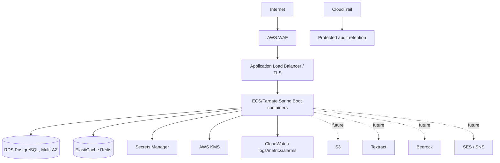
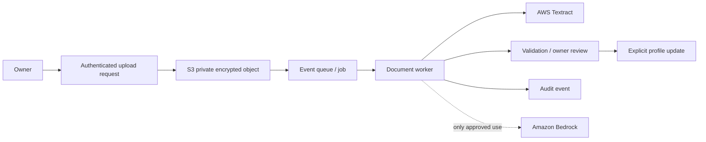

# AWS architecture — target deployment

## Phase 1 runtime

Place ECS tasks, RDS, and Redis in private subnets across at least two availability zones. The load balancer is public; no database or cache endpoint is public. Use security groups to allow only application-to-database/cache traffic. TLS terminates at the ALB and is enforced between service components where supported. Keep application secrets in Secrets Manager and use task IAM roles rather than static AWS keys. Encrypt RDS, Redis backups, S3 (when added), secrets, and audit stores with KMS-managed keys.

## Future document-processing flow

Document processing is intentionally deferred from Phase 1. When approved, the application must make the document-policy decision before issuing any controlled object URL; S3 never evaluates `PUBLIC_TO_QR`/`PRIVATE` policy and is never public. The bounded pipeline is:

Upload should use short-lived, constrained presigned URLs; scan/type/size-validate files; isolate untrusted documents; retain originals only under an approved policy; and require owner review before extracted text affects the emergency profile. Download URLs are generated only after the Spring Boot document-authorization service revalidates the emergency session, document policy, and private-document authorization where required. They are object-specific, brief, and cannot outlive the authorization/session boundary. Textract or Bedrock output is untrusted input, not medical truth. Do not send data to Bedrock until the applicable data-use, retention, regional, and consent decisions are approved.

SES/SNS are reserved for opt-in account and security notifications. Notifications must never include emergency medical content or a live emergency-session link.
