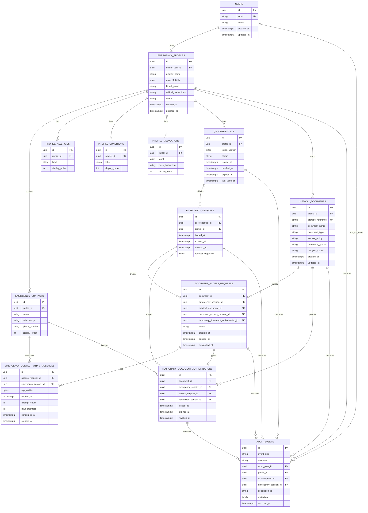

# Database ER diagram — Phase 1

## Relational rules

- `users.email` is unique after an explicitly chosen normalization policy.
- `emergency_profiles.owner_user_id` is unique, enforcing one profile per user for Phase 1.
- `qr_credentials.token_verifier` is unique; raw token material is never persisted.
- `display_order` is unique within its parent collection.
- Foreign keys prevent orphaned profile data. Audit foreign keys may be nullable when an event is rejected before a target is resolved.
- `medical_documents.access_policy` is constrained to `PUBLIC_TO_QR` or `PRIVATE`; document content is not a database column.
- A `document_access_request` must reference a private document and a currently eligible emergency session from that document's profile; this cross-table invariant is enforced in the application/service transaction.
- An OTP challenge's emergency contact must belong to the same profile as the requested document. Its verifier is one-way/keyed, its attempts are bounded, and it is single-use.
- `temporary_document_authorizations` has a unique `access_request_id` and must repeat the request's document/session references. Service validation enforces equality, expires the authorization no later than its session, and prevents cross-document/session confused-deputy grants.
- Deleting medically relevant data should be a deliberate policy decision. Phase 1 should use account/profile disabling and preserve audit evidence rather than hard-delete by default.
